# Application Walkthrough

This document provides a visual walkthrough of the key pages and features of the Robert's Rules of Management Motion Management System.

---

## Table of Contents

1. [Authentication](#authentication)
2. [User Dashboard](#user-dashboard)
3. [Committee Management](#committee-management)
4. [Motion Management](#motion-management)
5. [Voting & Discussion](#voting--discussion)
6. [Administrative Features](#administrative-features)
7. [User Settings](#user-settings)
8. [Organization Management](#organization-management)
9. [Navigation & Layout](#navigation--layout)

---

## Authentication

### Login/Signup Page
**Route**: `/login`

User authentication page that allows users to either log in to an existing account or register a new account. New users can optionally enter an organization invite code during registration to join an existing organization.

**Screenshot**:

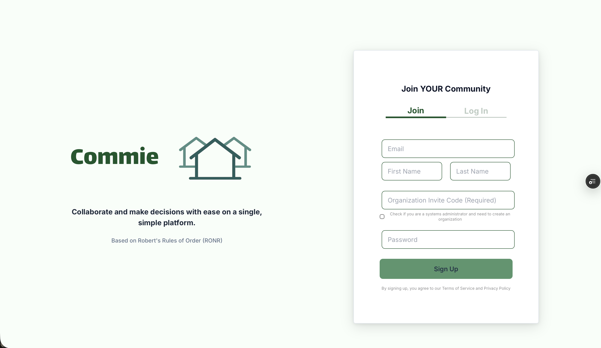

---

## User Dashboard

### Home Page 
**Route**: `/home`

The main dashboard for users showing an overview of all committees they belong to, recent activity, and quick access to their committees. This is the default landing page after login.

**Screenshot**:

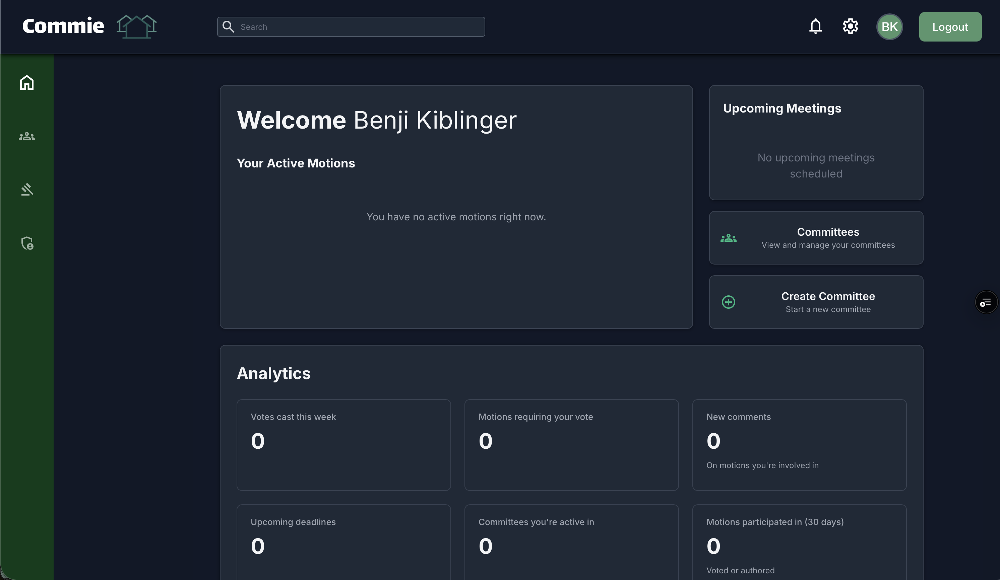

---

## Committee Management

### Committees Page
**Route**: `/committees`

Displays a paginated list of all committees the user has access to, with options to filter and search. Users can view committee details or navigate to create a new committee if they have the appropriate permissions.

**Screenshot**:

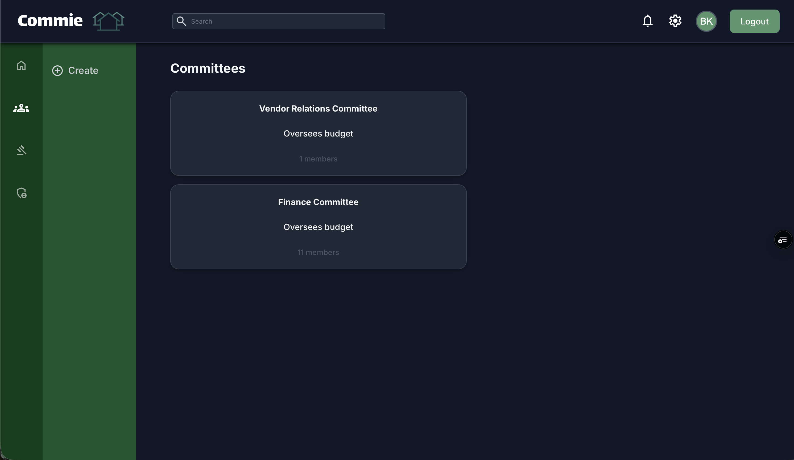

### Create Committee Page
**Route**: `/create-committee`

Form for creating a new committee within an organization. Users can set the committee name, description, add initial members, and assign a committee chair.

**Screenshot**:

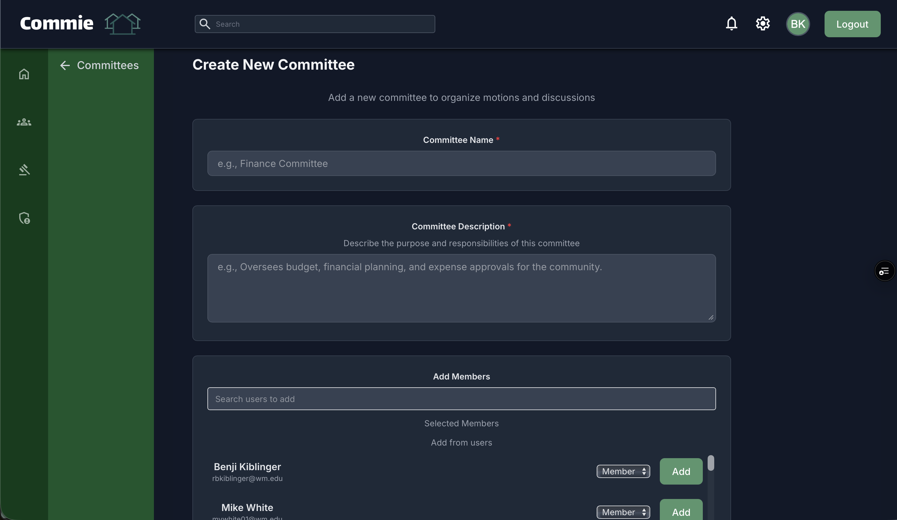

### Committee Motions Page
**Route**: `/committee/:id`

Shows all motions within a specific committee, with filtering options by motion type and status. Displays motion titles, vote counts, and current status (active, passed, failed, tabled).

**Screenshot**:

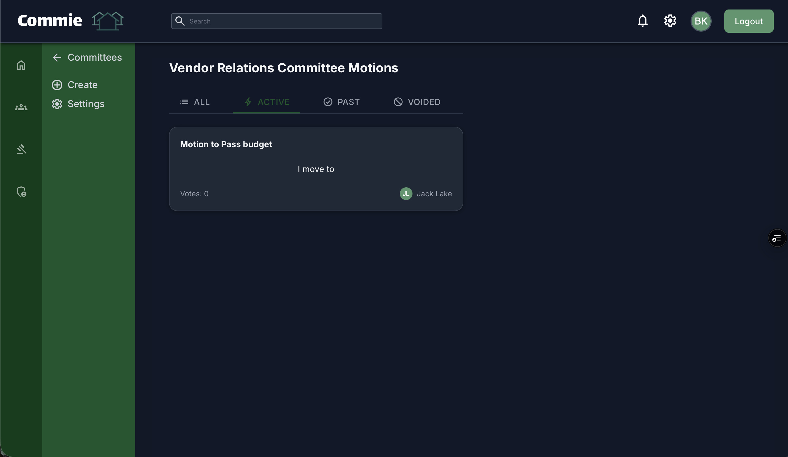

### Committee Settings Page
**Route**: `/committee/:id/settings`

Committee-specific configuration page (chair only) where chairs can manage committee members, adjust voting requirements, set quorum rules, discussion time minimums, and other parliamentary settings.

**Screenshot**:

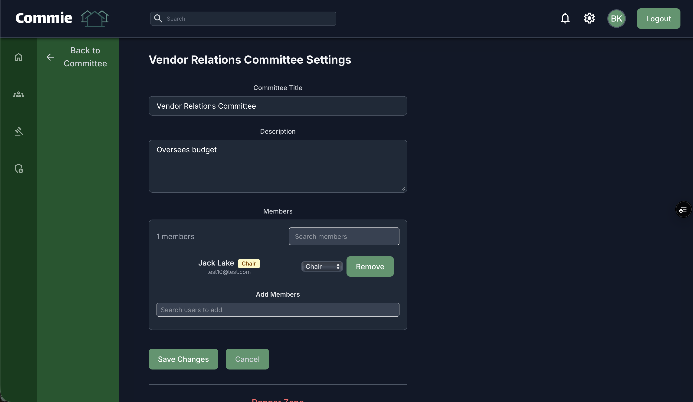

---

## Motion Management

### Create Motion Page
**Route**: `/committee/:id/create-motion`

Form for creating a new motion within a committee. Users can specify the motion type (main, amendment, table, etc.), set voting requirements, and mark whether the motion is debatable or amendable.

**Screenshot**:

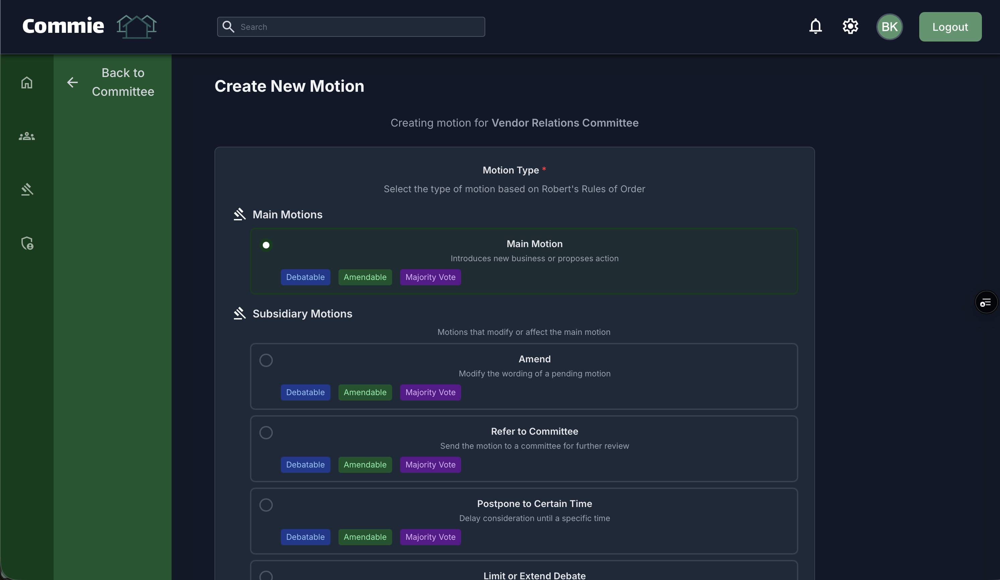

### Motion Details Page
**Route**: `/committee/:committeeId/motion/:motionId`

Comprehensive view of a single motion showing the full description, current vote counts, discussion comments with stance indicators (pro/con/neutral), and voting controls. Users can cast votes, add comments, and view subsidiary motions.

**Screenshot**:

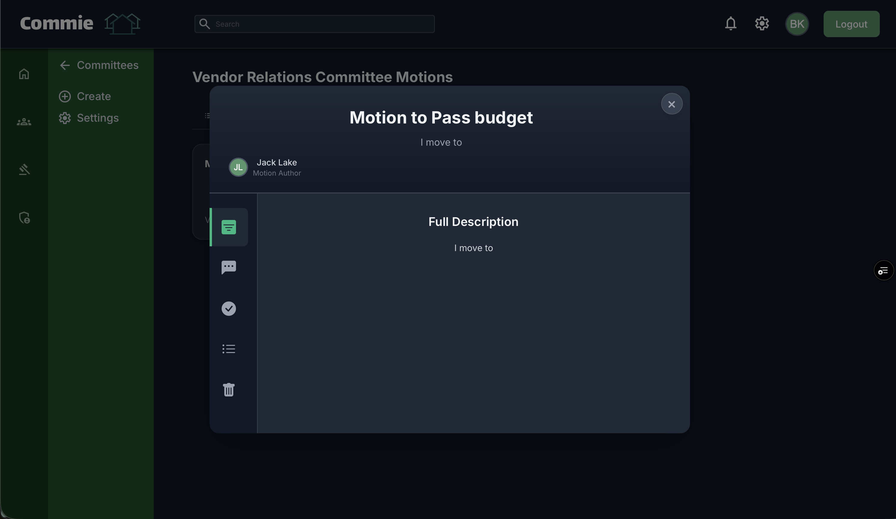

--- 

## Voting & Discussion

### Voting Interface
**Embedded in Motion Details Page**

Interactive voting panel within the motion details page that displays real-time vote counts, shows voting eligibility status, and allows users to cast yes/no/abstain votes. Automatically closes motions when voting thresholds are met.

**Screenshot**:

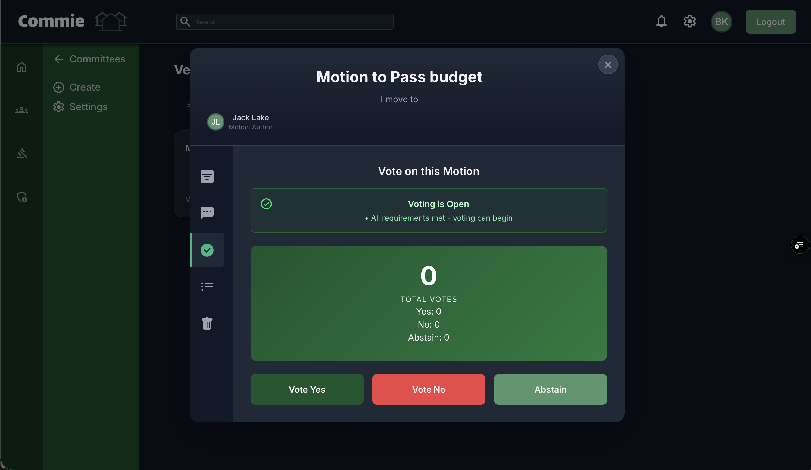

### Discussion/Comments Section
**Embedded in Motion Details Page**

Threaded comment system where users can discuss motions and mark their stance as pro, con, or neutral. Includes system messages for voting events and allows chairs to moderate discussions.

**Screenshot**:

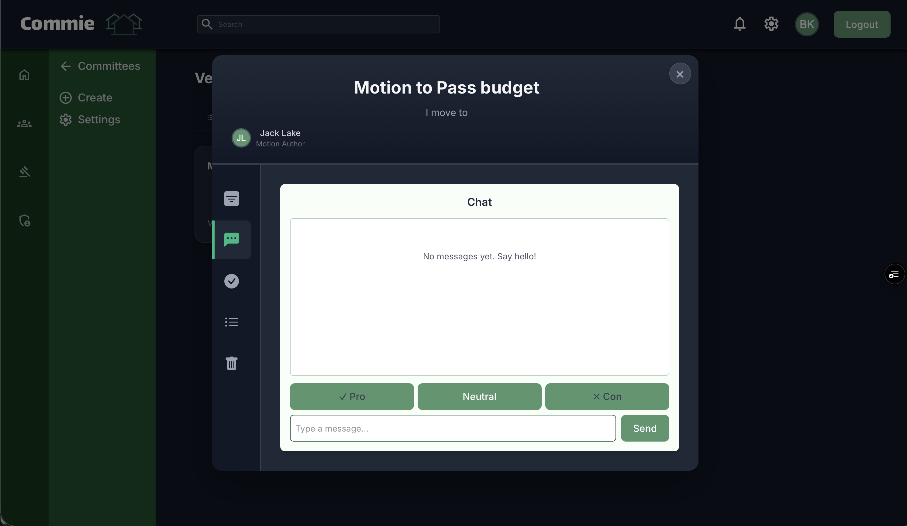

---

## Administrative Features

### Chair Control Panel
**Route**: `/chair-control`

Dedicated control panel for committee chairs to manage all committees they chair. Provides quick access to committee settings, member management, motion controls, and the ability to manually open or close voting periods.

**Screenshot**:

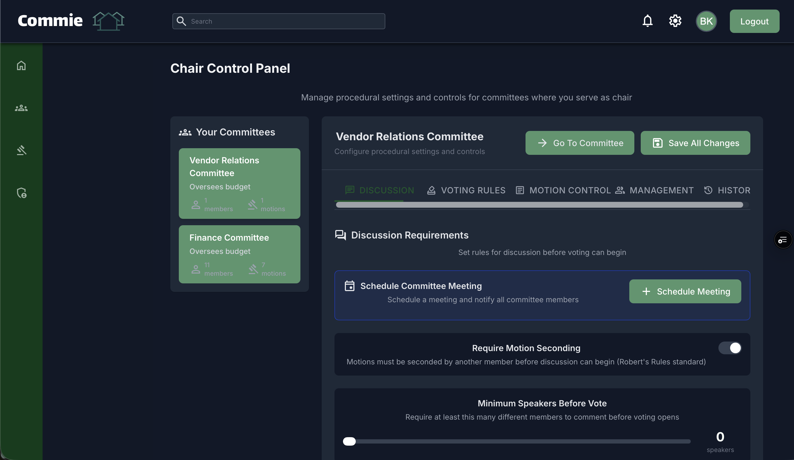

### Admin Panel
**Route**: `/admin`

Platform administration panel (super-admin and org-admin only) for managing organizations, users, permissions, and system-wide settings. Org-admins see only their organization's data while super-admins have platform-wide access.

**Screenshot**:

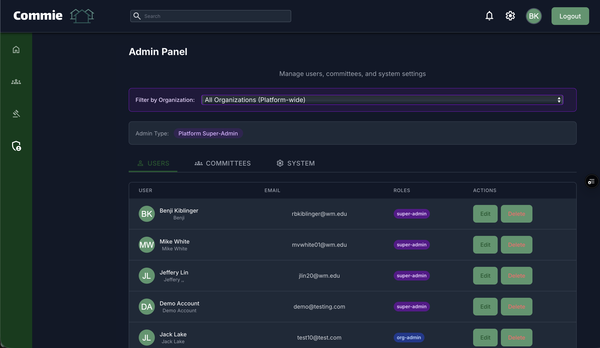

### Notifications Page
**Accessed via notification bell icon**

Displays all user notifications including access requests, voting alerts, motion status updates, and meeting reminders. Users can approve/deny access requests and mark notifications as seen.

**Screenshot**:

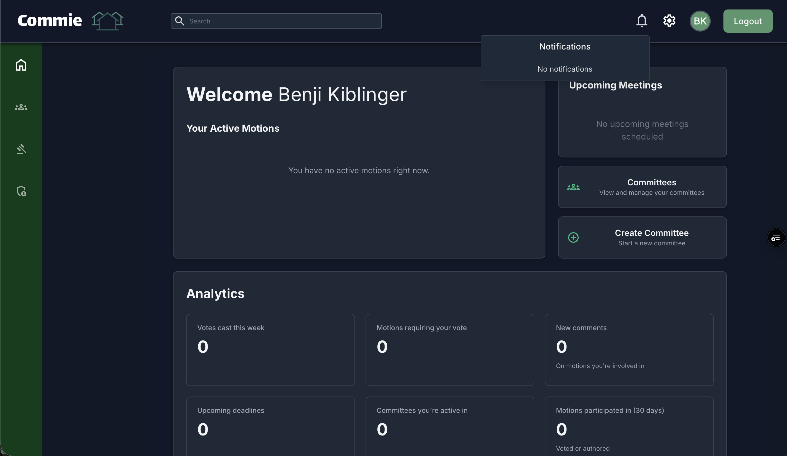

---

## User Settings

### Profile Page
**Route**: `/profile`

User profile management page where users can update their personal information, bio, contact details, and profile picture. Also displays user role information and organization membership.

**Screenshot**:

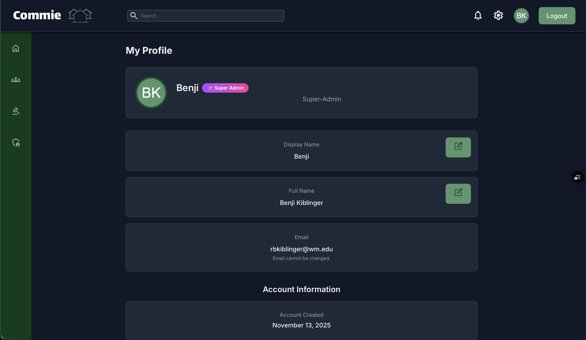

### Settings Page
**Route**: `/settings`

User preferences configuration including theme selection (light/dark mode), notification preferences, display name customization, and account management options.

**Screenshot**:

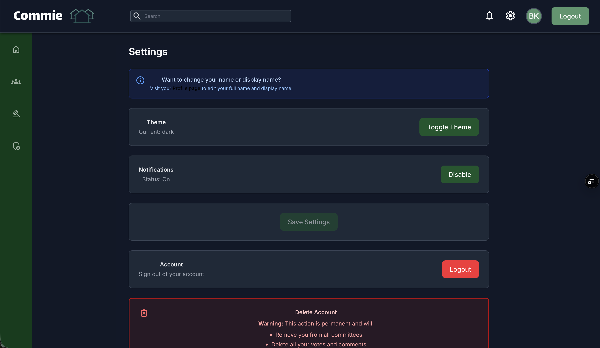

---

## Navigation & Layout

### Sidebar Navigation
**Available on all authenticated pages**

Persistent sidebar navigation providing quick access to user dashboard, committees, notifications, settings, and chair/admin controls (when applicable). Collapsible on mobile devices.

### Header Navigation
**Available on all authenticated pages**

Top navigation bar displaying the current page title, organization context, search functionality, and user profile menu with quick access to profile and logout.

---

## Key Features Demonstrated

### Vote Threshold System
Configurable voting requirements with automatic motion resolution:
- **Simple Majority**: >50% yes votes
- **Supermajority**: ≥66.67% yes votes (2/3 majority)
- **Unanimous**: 100% yes votes

**Screenshot**:

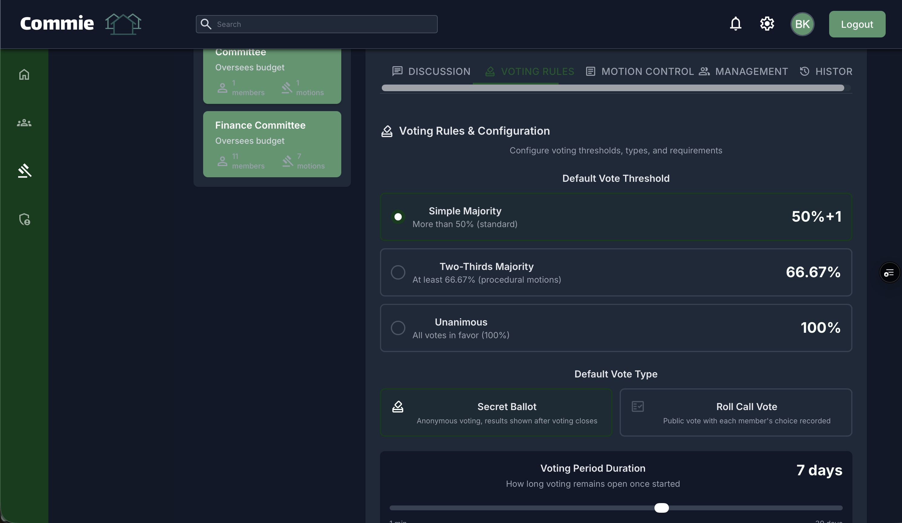

### Role-Based Access Control
Different interfaces and permissions based on user roles:
- **Super-Admin**: Platform-wide access across all organizations
- **Organization Admin**: Organization-scoped administrative access
- **Committee Chair**: Committee management and motion control
- **Committee Member**: Voting and discussion participation
- **Guest**: Read-only access to committees

**Screenshot**:

---

## Mobile Responsiveness

All pages are optimized for mobile viewing with responsive layouts, collapsible navigation, and touch-friendly controls.

**Screenshot (Mobile View)**:

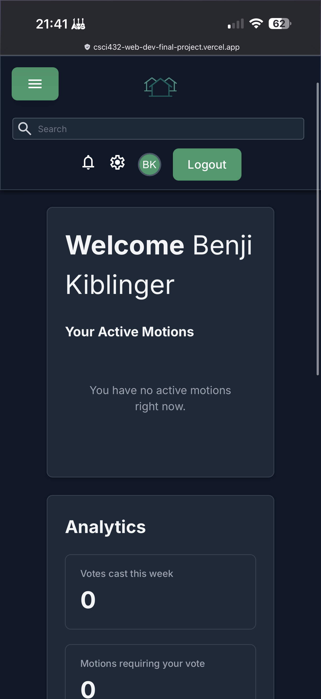

---

